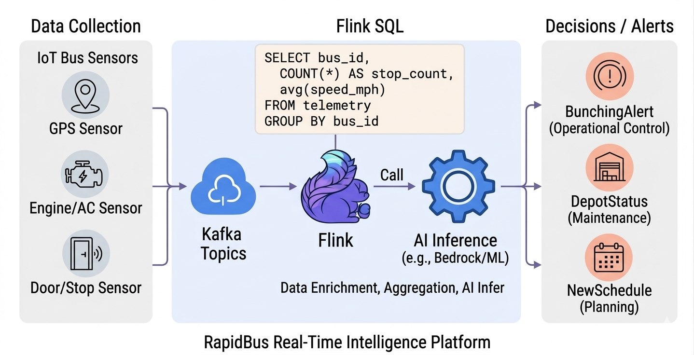
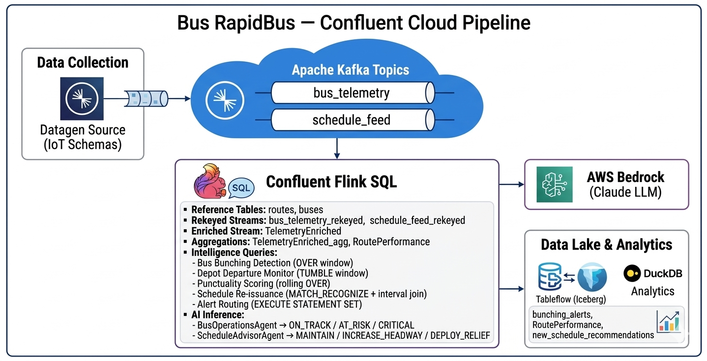

# Workshop: Real-Time Bus Fleet Intelligence with Confluent Cloud (Kafka + Flink SQL)
### Government Bus Tracking & Operations System


> **Use Case:** Public Bus Fleet Operations

---

## Overview

This workshop builds a **real-time bus fleet intelligence pipeline** for RapidBus using **Confluent Cloud (Kafka + Flink SQL)**. You will ingest live IoT sensor telemetry from buses, process and enrich the data in Flink SQL, and apply AI-driven inference to automatically detect:

- **Bus bunching** (multiple buses too close together on the same route)
- **Depot departure delays** and schedule adherence
- **Punctuality scoring** per bus and route
- **Live schedule re-issuance** based on real-time conditions

Instead of static timetables, the system reacts to live GPS, door sensor, and engine telemetry — producing actionable operational decisions in real time.




---

## Table of Contents

1. [Objectives](#objectives)
2. [Prerequisites](#prerequisites)
3. [Step 1 — Confluent Cloud Account Setup](#step-1--confluent-cloud-account-setup)
4. [Step 2 — Install Confluent CLI](#step-2--install-confluent-cli)
5. [Step 3 — Create Environment, Kafka Cluster, Flink Compute Pool](#step-3--create-environment-kafka-cluster-flink-compute-pool)
6. [Step 4 — Create API Keys](#step-4--create-api-keys)
7. [Step 5 — Create Kafka Topics](#step-5--create-kafka-topics)
8. [Step 6 — Create Datagen Source Connectors (Bus IoT Schemas)](#step-6--create-datagen-source-connectors-bus-iot-schemas)
   - [6.1 BusTelemetry Connector](#61-bustelemetry-connector)
   - [6.2 ScheduleFeed Connector](#62-schedulefeed-connector)
9. [Step 7 — Flink SQL: Reference Tables & Enrichment](#step-7--flink-sql-reference-tables--enrichment)
   - [7.1 Open Flink SQL Workspace](#71-open-flink-sql-workspace)
   - [7.2 Create Reference Tables (routes and buses)](#72-create-reference-tables-routes-and-buses)
   - [7.3 Rekey & Prepare Streaming Topics](#73-rekey--prepare-streaming-topics)
   - [7.4 Enrich Telemetry with Route & Bus Metadata](#74-enrich-telemetry-with-route--bus-metadata)
   - [7.5 Aggregate Telemetry with Tumbling Windows](#75-aggregate-telemetry-with-tumbling-windows)
   - [7.6 Verify Topics & Data Flow](#76-verify-topics--data-flow)
   - [7.7 Enrich & Aggregate Route Performance](#77-enrich--aggregate-route-performance)
10. [Step 8 — Flink SQL: Bus Operations Intelligence Queries](#step-8--flink-sql-bus-operations-intelligence-queries)
    - [8.1 Bus Bunching Detection (OVER Window)](#81-bus-bunching-detection-over-window)
    - [8.2 Depot Departure Monitoring (Tumbling Window)](#82-depot-departure-monitoring-tumbling-window)
    - [8.3 Punctuality Scoring (Rolling Window)](#83-punctuality-scoring-rolling-window)
    - [8.4 Live Schedule Re-issuance (Pattern + Interval Join)](#84-live-schedule-re-issuance-pattern--interval-join)
    - [8.5 Alert Routing (Statement Set)](#85-alert-routing-statement-set)
11. [Step 9 — Flink Agentic AI (LLM Inference via AWS Bedrock)](#step-9--flink-agentic-ai-llm-inference-via-aws-bedrock)
    - [9.1 Prepare AWS Bedrock Access](#91-prepare-aws-bedrock-access)
    - [9.2 Create Flink Connection](#92-create-flink-connection)
    - [9.3 Create AI Model — BusOperationsAgent](#93-create-ai-model--busoperationsagent)
    - [9.4 Invoke the Model](#94-invoke-the-model)
    - [9.5 Optional: Schedule Advisor Agent](#95-optional-schedule-advisor-agent)
12. [Phase 4 (Optional) — Tableflow + DuckDB](#phase-4-optional--tableflow--duckdb)
    - [12.1 Enable Tableflow on Key Topics (Confluent Cloud UI)](#121-enable-tableflow-on-key-topics-confluent-cloud-ui)
    - [12.2 Create a Tableflow API Key (Confluent Cloud UI)](#122-create-a-tableflow-api-key-confluent-cloud-ui)
    - [12.3 Query with DuckDB](#123-query-with-duckdb)
    - [12.4 Analytical Queries (DuckDB)](#124-analytical-queries-duckdb)
13. [Verification & Expected Results](#verification--expected-results)
14. [Cleanup](#cleanup)
15. [Notes & Tips](#notes--tips)

---

## Objectives

Design and implement a **real-time bus fleet intelligence system** where:

- **Datagen Connectors** simulate live IoT telemetry (GPS, door sensors, speed, AC, fuel) from the RapidBus fleet.
- **Flink SQL** transforms, enriches, and aggregates the data with route and fleet metadata.
- **Flink SQL Operations Queries** detect bunching, depot delays, and punctuality deviations.
- **An AI Agent (LLM via AWS Bedrock)** automatically classifies bus operational status and recommends actions.
- **(Optional) Tableflow** persists Flink outputs into **Iceberg tables** queryable by DuckDB for historical analysis.

---

## Prerequisites

- A **Confluent Cloud** account (trial or paid) at https://confluent.cloud
- **Confluent CLI** installed
- Access to **AWS Console** for Bedrock credentials (for Step 9)
- A modern browser

---

## Step 1 — Confluent Cloud Account Setup

1. Sign up and log in to **Confluent Cloud** at https://confluent.cloud.
2. Open **Billing & payment** → **Payment details & contacts**.
3. Enter promo code **`POPTOUT0006JDK5`** to use the platform for 5 days without a credit card (lab purposes).

---

## Step 2 — Install Confluent CLI

Install the CLI for your OS:
https://docs.confluent.io/confluent-cli/current/install.html

---

## Step 3 — Create Environment, Kafka Cluster, Flink Compute Pool

1. In Confluent Cloud, click **+ Add Environment** → enter a name (e.g. `rapidbus-env`) → **Create**.
2. Inside the environment, click **Create cluster**.
3. Choose **Basic Cluster** and set:
   - **Cloud:** AWS
   - **Region:** **Singapore (ap-southeast-1)** — closest to Malaysia
   - **Availability:** Single Zone
   - Name: `rapidbus-cluster` → **Launch cluster**
4. At the **environment level**, create a Flink compute pool: **Flink** → **Create Compute Pool**:
   - **Cloud Provider:** AWS
   - **Region:** **Singapore (ap-southeast-1)** (must match Kafka cluster)
   - **Pool name:** `rapidbus-flink-pool`
   - **Max CFU:** `10`
   - **Create**

---

## Step 4 — Create API Keys

1. Go to **Kafka Cluster** → **API Keys** → **Add Key**.
2. **Select account for API Key:** choose **My Account**.
3. **Next** → **Download** your **API Key** and **Secret**. Save securely — you'll need these for connectors.

---

## Step 5 — Create Kafka Topics

Create **2 topics** (Partitions: `1` for each):

| Topic Name        | Purpose                                      |
|-------------------|----------------------------------------------|
| `bus_telemetry`   | Live IoT sensor data from each bus           |
| `schedule_feed`   | Planned schedule vs. actual departure events |

**UI path:** Cluster → **Topics** → **+ Add Topic** → fill in name → **Create with defaults**.  
Skip the data contract creation step.

---

## Step 6 — Create Datagen Source Connectors (Bus IoT Schemas)

You'll create **2 Datagen Source** connectors to simulate real-time bus IoT data.

**UI path:** Cluster → **Connectors** → **+ Add Connector** → **Sample Data – Datagen Source** → configure.

> For all connectors:
> - **Kafka Credentials:** *Use existing API key* → supply your **API Key** and **Secret** (from Step 4)
> - **Output Record Value Format:** `JSON_SR`
> - **Select a Schema:** **Provide your own schema** (paste from below)
> - **Advanced Configuration → Max interval between messages (ms):** `10000`
> - **Tasks:** `1`

---

### 6.1 BusTelemetry Connector

This connector simulates GPS, speed, door state, engine temperature, fuel level, and passenger load — the core IoT matrix from a bus.

- **Topic Selection:** `bus_telemetry`
- **Name:** `bustelemetry`

**Schema:**

```json
{
  "type": "record",
  "name": "BusTelemetry",
  "namespace": "bus.rapidbus",
  "fields": [
    {
      "name": "telemetry_id",
      "type": {
        "type": "int",
        "arg.properties": {
          "range": { "min": 0, "max": 1000000000, "step": 1 }
        }
      }
    },
    {
      "name": "bus_id",
      "type": {
        "type": "string",
        "arg.properties": {
          "options": [
            "RB001","RB002","RB003","RB004","RB005",
            "RB006","RB007","RB008","RB009","RB010",
            "RB011","RB012","RB013","RB014","RB015"
          ]
        }
      }
    },
    {
      "name": "route_id",
      "type": {
        "type": "string",
        "arg.properties": {
          "options": [
            "B101","B102","B103","B104","B105",
            "B106","B107","B108","B109","B110"
          ]
        }
      }
    },
    {
      "name": "latitude",
      "type": {
        "type": "float",
        "arg.properties": { "range": { "min": 2.9, "max": 3.3 } }
      }
    },
    {
      "name": "longitude",
      "type": {
        "type": "float",
        "arg.properties": { "range": { "min": 101.5, "max": 101.9 } }
      }
    },
    {
      "name": "speed_kmh",
      "type": {
        "type": "float",
        "arg.properties": { "range": { "min": 0.0, "max": 80.0 } }
      }
    },
    {
      "name": "door_status",
      "type": {
        "type": "string",
        "arg.properties": { "options": ["OPEN","CLOSED","FAULT"] }
      }
    },
    {
      "name": "engine_temp_c",
      "type": {
        "type": "float",
        "arg.properties": { "range": { "min": 60.0, "max": 120.0 } }
      }
    },
    {
      "name": "fuel_level_pct",
      "type": {
        "type": "float",
        "arg.properties": { "range": { "min": 0.0, "max": 100.0 } }
      }
    },
    {
      "name": "passenger_count",
      "type": {
        "type": "int",
        "arg.properties": { "range": { "min": 0, "max": 80 } }
      }
    },
    {
      "name": "ac_status",
      "type": {
        "type": "string",
        "arg.properties": { "options": ["ON","OFF","FAULT"] }
      }
    },
    {
      "name": "depot_id",
      "type": {
        "type": "string",
        "arg.properties": {
          "options": [
            "DEPOT_KL_SELATAN","DEPOT_KL_UTARA",
            "DEPOT_PJ","DEPOT_SBH","DEPOT_KLANG"
          ]
        }
      }
    }
  ]
}
```

---

### 6.2 ScheduleFeed Connector

This connector simulates schedule adherence events — planned vs actual departure times per bus per stop.

- **Topic Selection:** `schedule_feed`
- **Name:** `schedulefeed`

**Schema:**

```json
{
  "type": "record",
  "name": "ScheduleFeed",
  "namespace": "bus.rapidbus",
  "fields": [
    {
      "name": "schedule_id",
      "type": {
        "type": "int",
        "arg.properties": {
          "range": { "min": 0, "max": 1000000000, "step": 1 }
        }
      }
    },
    {
      "name": "bus_id",
      "type": {
        "type": "string",
        "arg.properties": {
          "options": [
            "RB001","RB002","RB003","RB004","RB005",
            "RB006","RB007","RB008","RB009","RB010",
            "RB011","RB012","RB013","RB014","RB015"
          ]
        }
      }
    },
    {
      "name": "route_id",
      "type": {
        "type": "string",
        "arg.properties": {
          "options": [
            "B101","B102","B103","B104","B105",
            "B106","B107","B108","B109","B110"
          ]
        }
      }
    },
    {
      "name": "stop_id",
      "type": {
        "type": "string",
        "arg.properties": {
          "options": [
            "STOP_KL_SENTRAL","STOP_MASJID_JAMEK","STOP_CHOW_KIT",
            "STOP_TITIWANGSA","STOP_AMPANG","STOP_SRI_PETALING",
            "STOP_PUCHONG","STOP_SUBANG","STOP_KELANA_JAYA",
            "STOP_SHAH_ALAM"
          ]
        }
      }
    },
    {
      "name": "planned_departure_min",
      "type": {
        "type": "int",
        "arg.properties": { "range": { "min": 0, "max": 1440 } }
      }
    },
    {
      "name": "actual_departure_min",
      "type": {
        "type": "int",
        "arg.properties": { "range": { "min": 0, "max": 1450 } }
      }
    },
    {
      "name": "headway_target_min",
      "type": {
        "type": "int",
        "arg.properties": { "range": { "min": 5, "max": 20 } }
      }
    },
    {
      "name": "actual_headway_min",
      "type": {
        "type": "int",
        "arg.properties": { "range": { "min": 1, "max": 60 } }
      }
    }
  ]
}
```

Once both connectors are running, data should flow into the respective topics.

---

## Step 7 — Flink SQL: Reference Tables & Enrichment

### 7.1 Open Flink SQL Workspace

1. **Environments** → select your environment.
2. **Flink** → select `rapidbus-flink-pool` → **Open SQL workspace**.
3. Top-right of workspace:
   - **Catalog:** your **Environment**
   - **Database:** your **Kafka Cluster**
4. **Put each query in a separate query tab** (click `+` icon).

---

### 7.2 Create Reference Tables (routes and buses)

These static reference tables describe bus's routes and registered fleet. They will be used to enrich raw telemetry with operational context.

**1. Create the `routes` table:**

```sql
CREATE TABLE routes (
  route_id        STRING,
  route_name      STRING,
  origin          STRING,
  destination     STRING,
  total_stops     INT,
  distance_km     FLOAT,
  depot_id        STRING,
  PRIMARY KEY (route_id) NOT ENFORCED
);
```

**2. Insert route records:**

```sql
INSERT INTO routes VALUES
  ('B101', 'KL Sentral – Chow Kit', 'KL Sentral', 'Chow Kit', 12, 8.5, 'DEPOT_KL_UTARA'),
  ('B102', 'Titiwangsa – Ampang', 'Titiwangsa', 'Ampang', 10, 7.2, 'DEPOT_KL_SELATAN'),
  ('B103', 'Sri Petaling – Puchong', 'Sri Petaling', 'Puchong', 15, 12.0, 'DEPOT_PJ'),
  ('B104', 'Subang – Kelana Jaya', 'Subang', 'Kelana Jaya', 8, 6.1, 'DEPOT_PJ'),
  ('B105', 'Shah Alam – KL Sentral', 'Shah Alam', 'KL Sentral', 20, 28.0, 'DEPOT_SBH'),
  ('B106', 'Klang – KL Sentral', 'Klang', 'KL Sentral', 22, 38.0, 'DEPOT_KLANG'),
  ('B107', 'Chow Kit – Titiwangsa', 'Chow Kit', 'Titiwangsa', 6, 3.5, 'DEPOT_KL_UTARA'),
  ('B108', 'Ampang – Masjid Jamek', 'Ampang', 'Masjid Jamek', 9, 6.8, 'DEPOT_KL_SELATAN'),
  ('B109', 'Puchong – Subang', 'Puchong', 'Subang', 11, 9.4, 'DEPOT_PJ'),
  ('B110', 'Kelana Jaya – Shah Alam', 'Kelana Jaya', 'Shah Alam', 14, 15.3, 'DEPOT_SBH');
```

**3. Create the `buses` table:**

```sql
CREATE TABLE buses (
  bus_id        STRING,
  plate_number  STRING,
  bus_model     STRING,
  capacity      INT,
  route_id      STRING,
  depot_id      STRING,
  status        STRING,
  PRIMARY KEY (bus_id) NOT ENFORCED
);
```

**4. Insert fleet records:**

```sql
INSERT INTO buses VALUES
  ('RB001', 'WA1234B', 'Yutong E12', 80, 'B101', 'DEPOT_KL_UTARA', 'Active'),
  ('RB002', 'WA1235B', 'Volvo 7900', 78, 'B101', 'DEPOT_KL_UTARA', 'Active'),
  ('RB003', 'WA1236B', 'Yutong E12', 80, 'B102', 'DEPOT_KL_SELATAN', 'Active'),
  ('RB004', 'WA1237B', 'MAN Lions City', 85, 'B102', 'DEPOT_KL_SELATAN', 'Active'),
  ('RB005', 'WA1238B', 'Yutong E12', 80, 'B103', 'DEPOT_PJ', 'Active'),
  ('RB006', 'WA1239B', 'Volvo 7900', 78, 'B103', 'DEPOT_PJ', 'Active'),
  ('RB007', 'WA1240B', 'MAN Lions City', 85, 'B104', 'DEPOT_PJ', 'Active'),
  ('RB008', 'WA1241B', 'Yutong E12', 80, 'B105', 'DEPOT_SBH', 'Active'),
  ('RB009', 'WA1242B', 'Volvo 7900', 78, 'B106', 'DEPOT_KLANG', 'Active'),
  ('RB010', 'WA1243B', 'MAN Lions City', 85, 'B106', 'DEPOT_KLANG', 'Active'),
  ('RB011', 'WA1244B', 'Yutong E12', 80, 'B107', 'DEPOT_KL_UTARA', 'Active'),
  ('RB012', 'WA1245B', 'Volvo 7900', 78, 'B108', 'DEPOT_KL_SELATAN', 'Active'),
  ('RB013', 'WA1246B', 'Yutong E12', 80, 'B109', 'DEPOT_PJ', 'Active'),
  ('RB014', 'WA1247B', 'MAN Lions City', 85, 'B110', 'DEPOT_SBH', 'Active'),
  ('RB015', 'WA1248B', 'Volvo 7900', 78, 'B110', 'DEPOT_SBH', 'Active');
```

You should see the `routes` and `buses` topics appear in the Confluent Cloud Topics list.

---

### 7.3 Rekey & Prepare Streaming Topics

Raw topics need proper primary keys and event-time watermarks before being used in joins, aggregations, and windowed queries.

**1. Create `bus_telemetry_rekeyed`:**

```sql
CREATE TABLE bus_telemetry_rekeyed (
  telemetry_id    INT NOT NULL PRIMARY KEY NOT ENFORCED,
  bus_id          STRING,
  route_id        STRING,
  latitude        FLOAT,
  longitude       FLOAT,
  speed_kmh       FLOAT,
  door_status     STRING,
  engine_temp_c   FLOAT,
  fuel_level_pct  FLOAT,
  passenger_count INT,
  ac_status       STRING,
  depot_id        STRING,
  event_time      TIMESTAMP_LTZ(3) METADATA FROM 'timestamp',
  WATERMARK FOR event_time AS event_time - INTERVAL '5' SECOND
) DISTRIBUTED BY (telemetry_id) INTO 1 BUCKETS
WITH ('changelog.mode' = 'upsert');
```

**2. Populate from raw topic:**

```sql
INSERT INTO bus_telemetry_rekeyed
SELECT
  telemetry_id,
  bus_id,
  route_id,
  latitude,
  longitude,
  speed_kmh,
  door_status,
  engine_temp_c,
  fuel_level_pct,
  passenger_count,
  ac_status,
  depot_id,
  $rowtime AS event_time
FROM bus_telemetry;
```

**3. Create `schedule_feed_rekeyed`:**

```sql
CREATE TABLE schedule_feed_rekeyed (
  schedule_id          INT NOT NULL PRIMARY KEY NOT ENFORCED,
  bus_id               STRING,
  route_id             STRING,
  stop_id              STRING,
  planned_departure_min INT,
  actual_departure_min  INT,
  headway_target_min    INT,
  actual_headway_min    INT,
  event_time           TIMESTAMP_LTZ(3) METADATA FROM 'timestamp'
) DISTRIBUTED BY (schedule_id) INTO 1 BUCKETS
WITH ('changelog.mode' = 'upsert');
```

**4. Populate from raw topic:**

```sql
INSERT INTO schedule_feed_rekeyed
SELECT
  schedule_id,
  bus_id,
  route_id,
  stop_id,
  planned_departure_min,
  actual_departure_min,
  headway_target_min,
  actual_headway_min,
  $rowtime AS event_time
FROM schedule_feed;
```

---

### 7.4 Enrich Telemetry with Route & Bus Metadata

Join the raw telemetry stream with `buses` and `routes` reference tables to produce a fully enriched stream.

**1. Create `TelemetryEnriched` table:**

```sql
CREATE TABLE TelemetryEnriched (
  telemetry_id     INT NOT NULL PRIMARY KEY NOT ENFORCED,
  bus_id           STRING,
  plate_number     STRING,
  bus_model        STRING,
  bus_capacity     INT,
  bus_status       STRING,
  route_id         STRING,
  route_name       STRING,
  origin           STRING,
  destination      STRING,
  depot_id         STRING,
  latitude         FLOAT,
  longitude        FLOAT,
  speed_kmh        FLOAT,
  door_status      STRING,
  engine_temp_c    FLOAT,
  fuel_level_pct   FLOAT,
  passenger_count  INT,
  occupancy_pct    FLOAT,
  ac_status        STRING,
  event_time       TIMESTAMP_LTZ(3) METADATA FROM 'timestamp',
  WATERMARK FOR event_time AS event_time - INTERVAL '5' SECOND
) DISTRIBUTED BY (telemetry_id) INTO 1 BUCKETS
WITH ('changelog.mode' = 'upsert');
```

**2. Populate with enriched data:**

```sql
INSERT INTO TelemetryEnriched
SELECT
  t.telemetry_id,
  t.bus_id,
  b.plate_number,
  b.bus_model,
  b.capacity        AS bus_capacity,
  b.status          AS bus_status,
  t.route_id,
  r.route_name,
  r.origin,
  r.destination,
  t.depot_id,
  t.latitude,
  t.longitude,
  t.speed_kmh,
  t.door_status,
  t.engine_temp_c,
  t.fuel_level_pct,
  t.passenger_count,
  CAST(t.passenger_count AS FLOAT) / CAST(b.capacity AS FLOAT) * 100.0 AS occupancy_pct,
  t.ac_status,
  t.event_time
FROM bus_telemetry_rekeyed t
LEFT JOIN buses b   ON t.bus_id   = b.bus_id
LEFT JOIN routes r  ON t.route_id = r.route_id;
```

---

### 7.5 Aggregate Telemetry with Tumbling Windows

Summarize bus performance over **5-minute tumbling windows** per bus.

```sql
CREATE TABLE TelemetryEnriched_agg AS
SELECT
  bus_id,
  plate_number,
  bus_model,
  route_id,
  route_name,
  depot_id,
  DATE_FORMAT(window_start, 'yyyy-MM-dd HH:mm:ss') AS window_start_str,
  DATE_FORMAT(window_end,   'yyyy-MM-dd HH:mm:ss') AS window_end_str,
  COUNT(*)                  AS reading_count,
  AVG(speed_kmh)            AS avg_speed_kmh,
  AVG(engine_temp_c)        AS avg_engine_temp_c,
  AVG(fuel_level_pct)       AS avg_fuel_level_pct,
  AVG(occupancy_pct)        AS avg_occupancy_pct,
  AVG(passenger_count)      AS avg_passenger_count,
  SUM(CASE WHEN door_status = 'FAULT' THEN 1 ELSE 0 END) AS door_fault_count,
  SUM(CASE WHEN ac_status   = 'FAULT' THEN 1 ELSE 0 END) AS ac_fault_count,
  SUM(CASE WHEN engine_temp_c > 100.0 THEN 1 ELSE 0 END) AS engine_overheat_count
FROM TABLE(
  TUMBLE(TABLE TelemetryEnriched, DESCRIPTOR(event_time), INTERVAL '5' MINUTES)
)
GROUP BY
  bus_id, plate_number, bus_model, route_id, route_name, depot_id,
  window_start, window_end;
```

---

### 7.6 Verify Topics & Data Flow

Run these in the Flink SQL workspace to confirm data is flowing:

```sql
-- List all tables
SHOW TABLES;

-- Check rekeyed streams
SELECT * FROM bus_telemetry_rekeyed  LIMIT 10;
SELECT * FROM schedule_feed_rekeyed  LIMIT 10;

-- Check enriched stream
SELECT * FROM TelemetryEnriched      LIMIT 10;

-- Check aggregations
SELECT * FROM TelemetryEnriched_agg  LIMIT 10;
```

---

### 7.7 Enrich & Aggregate Route Performance

Combine schedule adherence and telemetry data to compute route-level performance KPIs in a 5-minute tumbling window.

```sql
CREATE TABLE RoutePerformance AS
SELECT
  r.route_id,
  r.route_name,
  r.origin,
  r.destination,
  r.depot_id,
  DATE_FORMAT(window_start, 'yyyy-MM-dd HH:mm:ss') AS window_start_str,
  DATE_FORMAT(window_end,   'yyyy-MM-dd HH:mm:ss') AS window_end_str,

  -- Schedule adherence metrics
  AVG(sf.actual_departure_min - sf.planned_departure_min) AS avg_delay_min,
  SUM(CASE WHEN (sf.actual_departure_min - sf.planned_departure_min) > 5 THEN 1 ELSE 0 END) AS late_departures,
  COUNT(sf.schedule_id) AS total_schedule_events,

  -- Headway / bunching metrics
  AVG(sf.actual_headway_min)                         AS avg_actual_headway_min,
  AVG(sf.headway_target_min)                         AS avg_target_headway_min,
  SUM(CASE WHEN sf.actual_headway_min < 2 THEN 1 ELSE 0 END) AS bunching_events,

  -- Telemetry metrics
  AVG(t.speed_kmh)       AS avg_speed_kmh,
  AVG(t.occupancy_pct)   AS avg_occupancy_pct,
  COUNT(t.telemetry_id)  AS telemetry_readings

FROM (
  SELECT *
  FROM TABLE(
    TUMBLE(TABLE bus_telemetry_rekeyed, DESCRIPTOR(event_time), INTERVAL '5' MINUTES)
  )
) t
LEFT JOIN schedule_feed_rekeyed sf
  ON t.bus_id = sf.bus_id AND t.route_id = sf.route_id
LEFT JOIN routes r
  ON t.route_id = r.route_id
GROUP BY
  r.route_id, r.route_name, r.origin, r.destination, r.depot_id,
  window_start, window_end;
```

---

## Step 8 — Flink SQL: Bus Operations Intelligence Queries

### 8.1 Bus Bunching Detection (OVER Window)

Bus bunching occurs when two or more buses on the same route have an actual headway below the threshold. This rolling window query flags each schedule event where bunching is occurring.

```sql
SELECT
  schedule_id,
  bus_id,
  route_id,
  stop_id,
  actual_headway_min,
  headway_target_min,
  AVG(actual_headway_min) OVER w AS avg_headway_last_hour,
  CASE
    WHEN actual_headway_min < 2 THEN 'BUNCHING'
    WHEN actual_headway_min < headway_target_min * 0.5 THEN 'WARNING'
    ELSE 'NORMAL'
  END AS bunching_status
FROM schedule_feed_rekeyed
WINDOW w AS (
  PARTITION BY route_id
  ORDER BY event_time ASC
  RANGE BETWEEN INTERVAL '1' HOUR PRECEDING AND CURRENT ROW
);
```

**Why this query:** Gives a per-event rolling average headway per route, enabling real-time bunching alerts without waiting for a full window to close.

---

### 8.2 Depot Departure Monitoring (Tumbling Window)

Track how many buses depart late from each depot within a 10-minute window. This helps depot managers take corrective action before delays cascade.

```sql
SELECT
  window_start,
  window_end,
  sf.route_id,
  r.depot_id,
  COUNT(*)                                                                AS total_departures,
  SUM(CASE WHEN (sf.actual_departure_min - sf.planned_departure_min) > 5  THEN 1 ELSE 0 END) AS late_departures,
  SUM(CASE WHEN (sf.actual_departure_min - sf.planned_departure_min) > 10 THEN 1 ELSE 0 END) AS critically_late,
  AVG(sf.actual_departure_min - sf.planned_departure_min)                 AS avg_delay_min
FROM TUMBLE(
       TABLE schedule_feed_rekeyed,
       DESCRIPTOR(event_time),
       INTERVAL '10' MINUTES
     ) sf
LEFT JOIN routes r ON sf.route_id = r.route_id
GROUP BY
  window_start, window_end, sf.route_id, r.depot_id;
```

**Why this query:** Produces time-bucketed depot performance summaries suitable for dashboards visible to depot controllers.

---

### 8.3 Punctuality Scoring (Rolling Window)

Compute a punctuality score per bus over the last hour. The score is the percentage of on-time departures (within 5 minutes of schedule).

```sql
SELECT
  bus_id,
  route_id,
  stop_id,
  actual_departure_min,
  planned_departure_min,
  (actual_departure_min - planned_departure_min) AS delay_min,
  COUNT(*) OVER w AS total_stops_last_hour,
  SUM(CASE WHEN (actual_departure_min - planned_departure_min) <= 5 THEN 1 ELSE 0 END) OVER w
    AS on_time_count,
  CAST(
    SUM(CASE WHEN (actual_departure_min - planned_departure_min) <= 5 THEN 1 ELSE 0 END) OVER w
    AS FLOAT
  ) / CAST(COUNT(*) OVER w AS FLOAT) * 100.0 AS punctuality_score_pct
FROM schedule_feed_rekeyed
WINDOW w AS (
  PARTITION BY bus_id
  ORDER BY event_time ASC
  RANGE BETWEEN INTERVAL '1' HOUR PRECEDING AND CURRENT ROW
);
```

**Why this query:** Unlike GROUP BY, this gives a punctuality score at every event — allowing the system to know a bus's current reliability trend without waiting for a batch window.

---

### 8.4 Live Schedule Re-issuance (Pattern + Interval Join)

Detect buses that have had 3 or more consecutive late departures and generate a new recommended schedule by joining with current route headway targets.

**Step 1 — Create the `schedule_violations` pattern table:**

```sql
CREATE TABLE schedule_violations (
  route_id              STRING,
  bus_id                STRING,
  stop_list             ARRAY<STRING>,
  delay_list            ARRAY<INT>,
  total_delay_min       INT,
  first_violation_time  TIMESTAMP_LTZ(3),
  last_violation_time   TIMESTAMP_LTZ(3)
);
```

**Step 2 — Populate via MATCH_RECOGNIZE:**

```sql
INSERT INTO schedule_violations
SELECT
  route_id,
  bus_id,
  stop_list,
  delay_list,
  total_delay,
  start_ts,
  end_ts
FROM schedule_feed_rekeyed
MATCH_RECOGNIZE (
  PARTITION BY route_id, bus_id
  ORDER BY event_time
  MEASURES
    ARRAY_AGG(late_event.stop_id)                                    AS stop_list,
    ARRAY_AGG(late_event.actual_departure_min - late_event.planned_departure_min) AS delay_list,
    SUM(late_event.actual_departure_min - late_event.planned_departure_min)       AS total_delay,
    FIRST(late_event.event_time)                                     AS start_ts,
    LAST(late_event.event_time)                                      AS end_ts
  ONE ROW PER MATCH
  AFTER MATCH SKIP PAST LAST ROW
  PATTERN (late_event{3})
  DEFINE
    late_event AS (late_event.actual_departure_min - late_event.planned_departure_min) > 5
) MR;
```

**Step 3 — Create the `new_schedule_recommendations` table:**

```sql
CREATE TABLE new_schedule_recommendations (
  route_id              STRING,
  bus_id                STRING,
  recommended_headway   INT,
  adjustment_reason     STRING,
  issued_at             TIMESTAMP_LTZ(3),
  PRIMARY KEY (bus_id) NOT ENFORCED
);
```

**Step 4 — Issue new schedule via interval join between violations and current telemetry:**

```sql
INSERT INTO new_schedule_recommendations
SELECT
  sv.route_id,
  sv.bus_id,
  r.headway_target_min + 5          AS recommended_headway,
  CONCAT(
    'Bus ', sv.bus_id, ' on route ', sv.route_id,
    ' had 3+ consecutive late departures. Total delay: ',
    CAST(sv.total_delay_min AS STRING), ' min. Adjusting headway.'
  )                                 AS adjustment_reason,
  sv.last_violation_time            AS issued_at
FROM schedule_violations sv
LEFT JOIN (
  SELECT route_id, AVG(headway_target_min) AS headway_target_min
  FROM schedule_feed_rekeyed
  GROUP BY route_id
) r ON sv.route_id = r.route_id;
```

---

### 8.5 Alert Routing (Statement Set)

Persist bunching and depot-delay alerts into dedicated alert topics, produced as a single Flink job.

**1. Create alert tables:**

```sql
CREATE TABLE bunching_alerts (
  schedule_id    INT,
  bus_id         STRING,
  route_id       STRING,
  stop_id        STRING,
  message        STRING,
  PRIMARY KEY (schedule_id) NOT ENFORCED
);
```

```sql
CREATE TABLE depot_delay_alerts (
  bus_id      STRING,
  route_id    STRING,
  depot_id    STRING,
  message     STRING,
  PRIMARY KEY (bus_id) NOT ENFORCED
);
```

**2. Execute as a Statement Set:**

```sql
EXECUTE STATEMENT SET
BEGIN
  INSERT INTO bunching_alerts
  SELECT
    sf.schedule_id,
    sf.bus_id,
    sf.route_id,
    sf.stop_id,
    CONCAT(
      'BUNCHING ALERT: Bus ', sf.bus_id,
      ' on route ', sf.route_id,
      ' at stop ', sf.stop_id,
      '. Actual headway: ', CAST(sf.actual_headway_min AS STRING),
      ' min (target: ', CAST(sf.headway_target_min AS STRING), ' min).'
    ) AS message
  FROM schedule_feed_rekeyed sf
  WHERE sf.actual_headway_min < 2;

  INSERT INTO depot_delay_alerts
  SELECT
    sf.bus_id,
    sf.route_id,
    r.depot_id,
    CONCAT(
      'DEPOT DELAY: Bus ', sf.bus_id,
      ' departed ', CAST(sf.actual_departure_min - sf.planned_departure_min AS STRING),
      ' minutes late from stop ', sf.stop_id,
      ' on route ', sf.route_id, '.'
    ) AS message
  FROM schedule_feed_rekeyed sf
  LEFT JOIN routes r ON sf.route_id = r.route_id
  WHERE (sf.actual_departure_min - sf.planned_departure_min) > 10;
END;
```

---

## Step 9 — Flink Agentic AI (LLM Inference via AWS Bedrock)

### 9.1 Prepare AWS Bedrock Access

1. Go to AWS Console → get credentials:
   ```bash
   export AWS_ACCESS_KEY_ID="AxxxAxxxxZ"
   export AWS_SECRET_ACCESS_KEY="ShyxxxeP5xxxxxxxxx/Xmuj7s"
   export AWS_SESSION_TOKEN="Gxxxxxxxxxxxxx15"
   ```
2. Get the Inference Profile ID, e.g. `apac.anthropic.claude-3-5-sonnet-20240620-v1:0`

---

### 9.2 Create Flink Connection

```bash
confluent login
confluent environment list
confluent environment use <env-id>

confluent flink connection create bedrock-connection \
  --cloud aws \
  --region ap-southeast-1 \
  --type bedrock \
  --endpoint https://bedrock-runtime.ap-southeast-1.amazonaws.com/model/apac.anthropic.claude-3-5-sonnet-20240620-v1:0/invoke \
  --aws-access-key $AWS_ACCESS_KEY_ID \
  --aws-secret-key $AWS_SECRET_ACCESS_KEY \
  --aws-session-token $AWS_SESSION_TOKEN
```

---

### 9.3 Create AI Model — BusOperationsAgent

```sql
CREATE MODEL BusOperationsAgent
INPUT (
  `details` VARCHAR(2147483647)
)
OUTPUT (
  `assessment` VARCHAR(2147483647)
)
WITH (
  'task'                         = 'text_generation',
  'provider'                     = 'bedrock',
  'bedrock.params.max_tokens'    = '500',
  'bedrock.connection'           = 'bedrock-connection',
  'bedrock.system_prompt'        = '
  You are a government bus fleet operations monitoring agent for RapidBus, Malaysia.
  Your task is to analyze aggregated bus telemetry and schedule data and assess the current
  operational status of each bus.

  Consider the following factors:
  - Average speed (km/h): below 5 may indicate stuck in traffic or breakdown.
  - Engine temperature (°C): above 100°C indicates overheating risk.
  - Fuel level (%): below 15% requires immediate depot return.
  - Door fault count: any fault is a safety concern.
  - AC fault count: comfort and safety issue for passengers.
  - Average delay (min): above 10 minutes is a punctuality failure.
  - Bunching events: more than 2 in a window indicates route management failure.

  Provide an assessment in one of these categories: ON_TRACK, AT_RISK, CRITICAL.
  Always include a brief reasoning and a recommended action for the depot or control room.

  Output format:
  bus_id : {id}
  assessment : {ON_TRACK | AT_RISK | CRITICAL}
  reasoning : {short explanation}
  recommended_action : {short action}
  '
);
```

---

### 9.4 Invoke the Model

```sql
ALTER TABLE TelemetryEnriched_agg SET ('changelog.mode' = 'append');
```

```sql
SELECT bus_id, route_id, assessment
FROM TelemetryEnriched_agg,
LATERAL TABLE(ML_PREDICT('BusOperationsAgent', CONCAT(
  'Bus ID: ',             bus_id,
  ', Route: ',            route_id,
  ', Depot: ',            depot_id,
  ', Avg Speed: ',        CAST(avg_speed_kmh       AS STRING), ' km/h',
  ', Avg Engine Temp: ',  CAST(avg_engine_temp_c   AS STRING), ' C',
  ', Avg Fuel: ',         CAST(avg_fuel_level_pct  AS STRING), '%',
  ', Avg Occupancy: ',    CAST(avg_occupancy_pct   AS STRING), '%',
  ', Door Faults: ',      CAST(door_fault_count    AS STRING),
  ', AC Faults: ',        CAST(ac_fault_count      AS STRING),
  ', Overheat Events: ',  CAST(engine_overheat_count AS STRING)
)));
```

---

### 9.5 Optional: Schedule Advisor Agent

Create a second agent to recommend corrective scheduling actions when route performance deteriorates.

```sql
CREATE MODEL ScheduleAdvisorAgent
INPUT (
  `details` VARCHAR(2147483647)
)
OUTPUT (
  `recommendation` VARCHAR(2147483647)
)
WITH (
  'task'                         = 'text_generation',
  'provider'                     = 'bedrock',
  'bedrock.params.max_tokens'    = '500',
  'bedrock.connection'           = 'bedrock-connection',
  'bedrock.system_prompt'        = '
  You are a schedule optimization advisor for RapidBus, a government public transport operator in Malaysia.
  Based on aggregated route performance data, recommend a corrective scheduling action.

  Options:
  - MAINTAIN_SCHEDULE   : performance is within acceptable parameters.
  - INCREASE_HEADWAY    : buses are bunching; widen the gap between buses.
  - DEPLOY_RELIEF_BUS   : high occupancy and delays; add extra bus to the route.
  - REROUTE             : route has repeated critical delays; consider temporary rerouting.
  - DEPOT_RECALL        : bus has mechanical issues; return to depot immediately.

  Thresholds to consider:
  - avg_delay_min > 10       → action needed
  - bunching_events > 2      → increase headway or deploy relief
  - avg_occupancy > 90%      → deploy relief bus
  - late_departures > 3      → schedule adjustment required

  Output format:
  route_id : {id}
  recommendation : {action}
  reasoning : {short justification}
  '
);
```

**Invoke:**

```sql
SELECT route_id, recommendation
FROM RoutePerformance,
LATERAL TABLE(ML_PREDICT('ScheduleAdvisorAgent', CONCAT(
  'Route ID: ',            route_id,
  ', Depot: ',             depot_id,
  ', Avg Delay: ',         CAST(avg_delay_min         AS STRING), ' min',
  ', Late Departures: ',   CAST(late_departures        AS STRING),
  ', Bunching Events: ',   CAST(bunching_events        AS STRING),
  ', Avg Headway: ',       CAST(avg_actual_headway_min AS STRING), ' min (target: ', CAST(avg_target_headway_min AS STRING), ')',
  ', Avg Occupancy: ',     CAST(avg_occupancy_pct      AS STRING), '%'
)));
```

---

## Phase 4 (Optional) — Tableflow + DuckDB

Enable **Tableflow** on key Flink output topics to persist them as **Apache Iceberg tables**, then query using **DuckDB** for historical analytics and reporting.

> **All Tableflow setup in this phase is done entirely through the Confluent Cloud UI — no CLI required.**

---

### 12.1 Enable Tableflow on Key Topics (Confluent Cloud UI)

Tableflow converts your Kafka topics into queryable Iceberg tables. Follow these steps for each topic listed below.

**Topics to enable:**

| Topic | Purpose |
|-------|---------|
| `bunching_alerts` | Bus bunching events per stop |
| `depot_delay_alerts` | Late departure alerts per depot |
| `new_schedule_recommendations` | AI-issued schedule adjustments |
| `RoutePerformance` | Aggregated route KPIs per time window |

**Step-by-step for each topic:**

1. In Confluent Cloud, navigate to your **Environment** → select your **Kafka cluster** (`rapidbus-cluster`).

2. In the left-hand menu, click **Tableflow**.

3. On the Tableflow landing page, click **Set up Tableflow** if this is your first time. Otherwise, proceed directly.

4. You will see a list of topics in your cluster. Locate `bunching_alerts` and click the toggle next to it to **Enable Tableflow**.

5. A dialog will appear asking you to choose a storage option:
   - Select **Confluent-managed storage** (recommended for this workshop).
   - Click **Enable**.

6. Repeat steps 4–5 for each remaining topic:
   - `depot_delay_alerts`
   - `new_schedule_recommendations`
   - `RoutePerformance`

7. Once enabled, each topic row will show a green **Active** status under Tableflow. The Iceberg table will begin materialising within **3–5 minutes**.

> **Tip:** You can monitor the sync status directly in the Tableflow UI. A row count and last-updated timestamp will appear once data starts flowing into the Iceberg table.

---

### 12.2 Create a Tableflow API Key (Confluent Cloud UI)

DuckDB needs credentials to connect to the Tableflow Iceberg REST catalog. You generate these from the UI.

1. In Confluent Cloud, click your **profile icon** (top-right) → **API keys**.

2. Click **+ Add API key**.

3. On the scope screen, select **Tableflow** as the resource type.

4. Select your **Environment** (`rapidbus-env`).

5. Click **Next** → choose **My Account** → **Next**.

6. Click **Download** to save the generated **API Key** (Client ID) and **API Secret** (Client Secret).  
   > Store these securely — the secret is shown only once.

7. Note down the **REST Catalog Endpoint** shown on the Tableflow page. It follows this format:
   ```
   https://tableflow.<REGION>.aws.confluent.cloud/iceberg/catalog/organizations/<ORG_ID>/environments/<ENV_ID>
   ```
   You can find the exact URL on the Tableflow overview page of your environment.

8. Also note your **Kafka Cluster ID** (format: `lkc-xxxxxx`) — visible on the cluster overview page under **Cluster settings**.

---

### 12.3 Query with DuckDB

With Tableflow enabled and credentials in hand, connect DuckDB to your Iceberg catalog.

**Install DuckDB:**

```bash
curl https://install.duckdb.org | sh
```

Launch DuckDB:

```bash
duckdb
```

**Install required extensions inside DuckDB:**

```sql
INSTALL httpfs;
LOAD httpfs;

INSTALL iceberg;
LOAD iceberg;
```

**Create the Tableflow catalog secret** (replace placeholders with your values from Step 12.2):

```sql
CREATE SECRET iceberg_secret (
  TYPE          ICEBERG,
  CLIENT_ID     '<YOUR_TABLEFLOW_API_KEY>',
  CLIENT_SECRET '<YOUR_TABLEFLOW_API_SECRET>',
  ENDPOINT      'https://tableflow.<REGION>.aws.confluent.cloud/iceberg/catalog/organizations/<ORG_ID>/environments/<ENV_ID>',
  OAUTH2_SCOPE  'catalog'
);
```

**Attach the Tableflow warehouse as a DuckDB catalog:**

```sql
ATTACH 'warehouse' AS iceberg_catalog (
  TYPE     iceberg,
  SECRET   iceberg_secret,
  ENDPOINT 'https://tableflow.<REGION>.aws.confluent.cloud/iceberg/catalog/organizations/<ORG_ID>/environments/<ENV_ID>'
);
```

**Switch to your cluster's namespace and verify tables:**

```sql
-- Replace lkc-xxxxxx with your actual Kafka Cluster ID
USE iceberg_catalog."lkc-xxxxxx";

SHOW TABLES;
```

You should see the four topics listed as Iceberg tables:

```
┌───────────────────────────────────────┐
│                 name                  │
├───────────────────────────────────────┤
│ bunching_alerts                       │
│ depot_delay_alerts                    │
│ new_schedule_recommendations          │
│ RoutePerformance                      │
└───────────────────────────────────────┘
```

---

### 12.4 Analytical Queries (DuckDB)

Run the following queries for operational analytics and government reporting. Replace `lkc-xxxxxx` with your actual cluster ID throughout.

**Preview live bunching alerts:**

```sql
SELECT *
FROM iceberg_catalog."lkc-xxxxxx"."bunching_alerts"
ORDER BY schedule_id DESC
LIMIT 20;
```

**Preview depot delay alerts:**

```sql
SELECT *
FROM iceberg_catalog."lkc-xxxxxx"."depot_delay_alerts"
LIMIT 20;
```

**Daily punctuality summary by route:**

```sql
SELECT
  route_id,
  COUNT(*)             AS total_windows,
  AVG(avg_delay_min)   AS avg_delay_min,
  SUM(late_departures) AS total_late_departures,
  SUM(bunching_events) AS total_bunching_events
FROM iceberg_catalog."lkc-xxxxxx"."RoutePerformance"
GROUP BY route_id
ORDER BY avg_delay_min DESC;
```

**Top 5 worst performing routes (by bunching):**

```sql
SELECT
  route_id,
  SUM(bunching_events)  AS bunching_total,
  SUM(late_departures)  AS late_total,
  AVG(avg_delay_min)    AS avg_delay_min,
  AVG(avg_occupancy_pct) AS avg_occupancy_pct
FROM iceberg_catalog."lkc-xxxxxx"."RoutePerformance"
GROUP BY route_id
ORDER BY bunching_total DESC
LIMIT 5;
```

**Routes with critically high average delay (>10 min):**

```sql
SELECT
  route_id,
  depot_id,
  AVG(avg_delay_min)   AS avg_delay_min,
  SUM(late_departures) AS total_late_departures
FROM iceberg_catalog."lkc-xxxxxx"."RoutePerformance"
GROUP BY route_id, depot_id
HAVING AVG(avg_delay_min) > 10
ORDER BY avg_delay_min DESC;
```

**New schedule recommendations issued (most recent first):**

```sql
SELECT
  route_id,
  bus_id,
  recommended_headway,
  adjustment_reason,
  issued_at
FROM iceberg_catalog."lkc-xxxxxx"."new_schedule_recommendations"
ORDER BY issued_at DESC;
```

**Depot performance summary (delay and bunching by depot):**

```sql
SELECT
  depot_id,
  COUNT(*)              AS route_windows,
  AVG(avg_delay_min)    AS avg_delay_min,
  SUM(bunching_events)  AS total_bunching,
  SUM(late_departures)  AS total_late
FROM iceberg_catalog."lkc-xxxxxx"."RoutePerformance"
GROUP BY depot_id
ORDER BY avg_delay_min DESC;
```

---

## Verification & Expected Results

### Topics & Connectors

- `bus_telemetry` and `schedule_feed` receive continuous records from the Datagen connectors.
- Rekeyed topics (`bus_telemetry_rekeyed`, `schedule_feed_rekeyed`) contain keyed events with event time and watermarks.

### Reference & Enrichment Tables

- `routes` and `buses` contain the static fleet and route metadata.
- `TelemetryEnriched` shows sensor readings joined with bus details and route info, including derived `occupancy_pct`.

### Aggregations

- `TelemetryEnriched_agg` contains 5-minute tumbling window summaries per bus (avg speed, engine temp, fuel, faults).
- `RoutePerformance` combines schedule and telemetry data per route with KPIs: avg delay, bunching events, late departures, and occupancy.

### Operational Intelligence Queries

- **Bunching detection** flags events with `BUNCHING`, `WARNING`, or `NORMAL` status in real time.
- **Depot departure monitoring** shows how many buses are late per depot in 10-minute windows.
- **Punctuality scoring** gives a rolling per-bus on-time percentage.
- **MATCH_RECOGNIZE** detects buses with 3+ consecutive late departures and produces new schedule recommendations.
- **Alert routing** populates `bunching_alerts` and `depot_delay_alerts` in a single Flink job.

### LLM Inference

- `BusOperationsAgent` returns assessments like `ON_TRACK`, `AT_RISK`, or `CRITICAL` per bus with reasoning and recommended action.
- `ScheduleAdvisorAgent` returns recommendations like `DEPLOY_RELIEF_BUS`, `INCREASE_HEADWAY`, or `DEPOT_RECALL` per route.

### Tableflow + DuckDB (Optional)

- All four topics show **Active** status in the Confluent Cloud Tableflow UI (enabled entirely via the UI, no CLI needed).
- DuckDB connects to the Iceberg REST catalog using the API key generated directly from the Confluent Cloud UI.
- Analytical queries return route performance summaries, depot delay rankings, and issued schedule recommendations.

---

## Cleanup

- **Pause/stop connectors** to halt data generation.
- **Drop Flink tables** created for the lab:
  ```sql
  DROP TABLE IF EXISTS bus_telemetry_rekeyed;
  DROP TABLE IF EXISTS schedule_feed_rekeyed;
  DROP TABLE IF EXISTS TelemetryEnriched;
  DROP TABLE IF EXISTS TelemetryEnriched_agg;
  DROP TABLE IF EXISTS RoutePerformance;
  DROP TABLE IF EXISTS bunching_alerts;
  DROP TABLE IF EXISTS depot_delay_alerts;
  DROP TABLE IF EXISTS schedule_violations;
  DROP TABLE IF EXISTS new_schedule_recommendations;
  DROP TABLE IF EXISTS routes;
  DROP TABLE IF EXISTS buses;
  ```
- Optionally **delete topics** and the environment in Confluent Cloud.
- Delete the Flink connection if created:
  ```bash
  confluent flink connection delete bedrock-connection \
    --cloud aws \
    --region ap-southeast-1 \
    --environment env-xxxx
  ```

---

## Notes & Tips

- Keep Kafka and Flink **cloud/region** aligned (`AWS / ap-southeast-1`) to avoid cross-region issues.
- Bus IDs (`RB001`–`RB015`) and route IDs (`B101`–`B110`) match between Datagen schemas and reference table inserts — this is intentional so joins produce enriched rows.
- If `TelemetryEnriched` has no data, verify that the `buses` and `routes` tables are populated before the `INSERT INTO TelemetryEnriched` job runs.
- The `MATCH_RECOGNIZE` query for schedule violations requires sufficient data volume. If violations are not appearing, lower the `late_event` threshold in `DEFINE` to `> 2` minutes.
- For the AI model, ensure `bedrock-connection` name matches exactly what was created via the CLI.
- `RoutePerformance` uses a tumbling window join; run it after both `bus_telemetry_rekeyed` and `schedule_feed_rekeyed` are actively receiving data.
- Never commit **API keys or AWS credentials** to version control. Use secrets managers in production.

---

## Architecture Diagram




---

*Workshop adapted for RapidBus government bus tracking use case. Based on Confluent Commercial Workshops — Mining (Example 1) and Flink Tableflow Banking (Example 2).*
